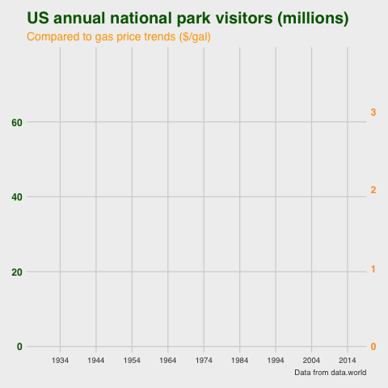

```{r setup, include=FALSE}
knitr::opts_chunk$set(echo = F)
```

## 2019 week 38 - National Park visits
### My first tidy tuesday contribution

<a href='scripts/2019_wk38_natparks.R' target='_blank'></a>